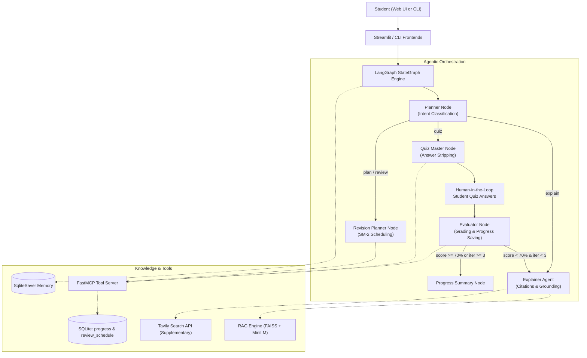
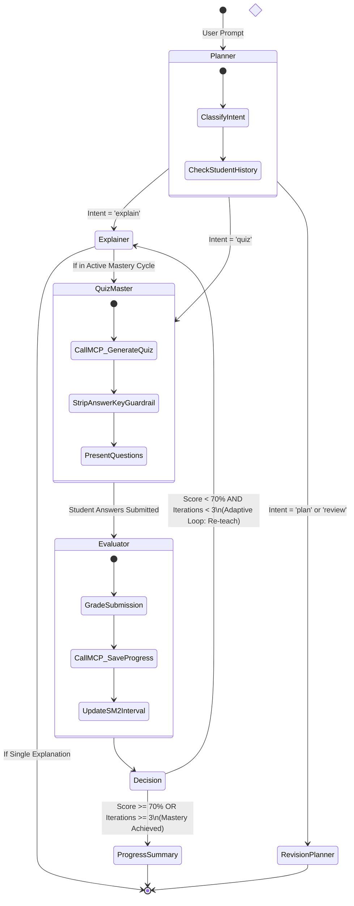
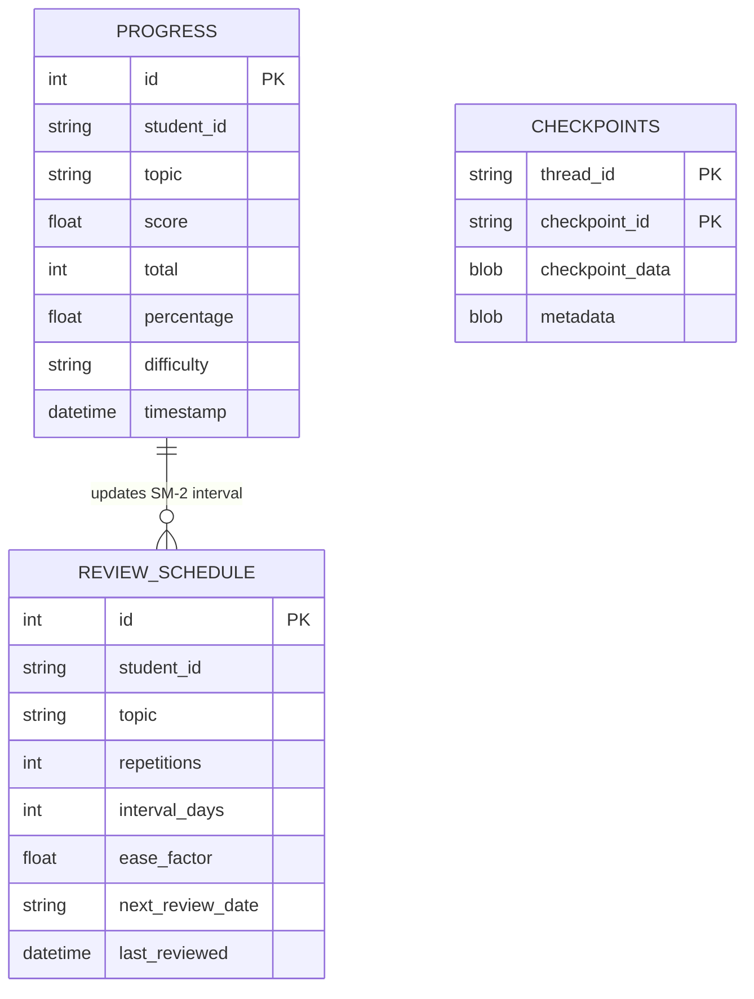

# System Architecture & Flow Diagrams

## 1. High-Level Component Architecture

```mermaid
graph TD
    User["Student (Web UI or CLI)"] --> UI["Streamlit / CLI Frontends"]
    UI --> Graph["LangGraph StateGraph Engine"]
    
    subgraph Agentic Orchestration
        Graph --> Planner["Planner Node<br/>(Intent Classification)"]
        Planner -->|explain| Explainer["Explainer Agent<br/>(Citations & Grounding)"]
        Planner -->|quiz| QM["Quiz Master Node<br/>(Answer Stripping)"]
        Planner -->|plan / review| RP["Revision Planner Node<br/>(SM-2 Scheduling)"]
        QM --> HIL["Human-in-the-Loop<br/>Student Quiz Answers"]
        HIL --> Evaluator["Evaluator Node<br/>(Grading & Progress Saving)"]
        
        Evaluator -->|score < 70% & iter < 3| Explainer
        Evaluator -->|score >= 70% or iter >= 3| Summary["Progress Summary Node"]
    end

    subgraph Knowledge & Tools
        Explainer -.-> RAG["RAG Engine (FAISS + MiniLM)"]
        Explainer -.-> Tavily["Tavily Search API (Supplementary)"]
        QM -.-> MCP["FastMCP Tool Server"]
        Evaluator -.-> MCP
        RP -.-> MCP
        MCP -.-> DB[(SQLite: progress & review_schedule)]
        Graph -.-> Checkpointer[(SqliteSaver Memory)]
    end
```

---

## 2. LangGraph Conditional Edge State Machine

```mermaid
stateDiagram-v2
    [*] --> Planner : User Prompt
    
    state Planner {
        [*] --> ClassifyIntent
        ClassifyIntent --> CheckStudentHistory
    }

    Planner --> Explainer : Intent = 'explain'
    Planner --> QuizMaster : Intent = 'quiz'
    Planner --> RevisionPlanner : Intent = 'plan' or 'review'

    state QuizMaster {
        [*] --> CallMCP_GenerateQuiz
        CallMCP_GenerateQuiz --> StripAnswerKeyGuardrail
        StripAnswerKeyGuardrail --> PresentQuestions
    }

    QuizMaster --> Evaluator : Student Answers Submitted

    state Evaluator {
        [*] --> GradeSubmission
        GradeSubmission --> CallMCP_SaveProgress
        CallMCP_SaveProgress --> UpdateSM2Interval
    }

    state "Conditional Mastery Edge" as Decision <<choice>>
    Evaluator --> Decision

    Decision --> Explainer : Score < 70% AND Iterations < 3\n(Adaptive Loop: Re-teach)
    Decision --> ProgressSummary : Score >= 70% OR Iterations >= 3\n(Mastery Achieved)

    Explainer --> QuizMaster : If in Active Mastery Cycle
    Explainer --> [*] : If Single Explanation
    RevisionPlanner --> [*]
    ProgressSummary --> [*]
```

---

## 3. Database Schema & Spaced Repetition (SM-2)

```mermaid
erDiagram
    PROGRESS {
        int id PK
        string student_id
        string topic
        float score
        int total
        float percentage
        string difficulty
        datetime timestamp
    }
    REVIEW_SCHEDULE {
        int id PK
        string student_id
        string topic
        int repetitions
        int interval_days
        float ease_factor
        string next_review_date
        datetime last_reviewed
    }
    CHECKPOINTS {
        string thread_id PK
        string checkpoint_id PK
        blob checkpoint_data
        blob metadata
    }

    PROGRESS ||--o{ REVIEW_SCHEDULE : "updates SM-2 interval"
```
